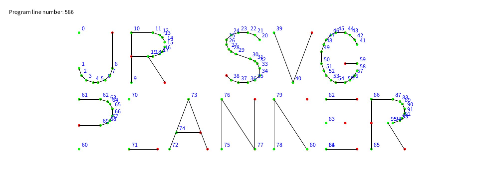

# UR SVG Planner

  

A simple [Processing](https://processing.org/) tool to import SVG files and export URscript code to control Universal Robots.

## How-To

- Create an SVG file with artboard top-left origin at 0x0m, with width/height 1x1m. Check the file `smiley.svg` for example.
- On the robot, properly setup the TCP translation/orientation offsets. If using the graphics convention of the origin top-left of drawing, with positive X axis going right, and positive Y axis going down, you must have the Z axis of the TCP pointing away of the tool flange.
- Measure a Plane feature in the Installation tab, so that your workspace has its origin top-right, positive X axis to the right and positive Y axis to the bottom. The positive Z axis will point towards the work surface, with negative Z going up in the air. This is just to follow SVG/graphics convention with positive Y axis going down. If you prefer a more conventional orientation with your origin bottom-left of your work surface, with positive X axis going right and positive Y axis going up, with positive Z axis going away of the work surface, you must mirror and offset your SVG file to match the inverted coordinate systems, and invert your TCP Z axis to point towards the robot tool flange.
- Configure the various settings, default works well for simple path tracing with a pen.
- Place your SVG file in the `/data` folder, adjust `filename_in` and `filename_out` variables.
- Run the sketch, you will have a file with .script extension in the `/data` folder.
- Place this file on a USB key, insert it in the robot Teach Pendant.
- Create an empty program, add a `Code Script` block, select File instead of Line, navigate and open your file on the USB drive.
- Set the Speed Slider to a low value like 10% for testing
- Press Play to run your program, pay attention to check that everything matches, offsets and orientation are correct.

## This is not safety advice!

Even if cobots like Universal Robots are sort-of-safe, be extremely wary when adding sharp, pointy tools, running at high speeds, etc. Stay out of reach of the robot, wear eye protection if necessary, etc. Always run the robot in Most Restricted safety mode if possible, use the speed slider to test programs and verify that everything is correct.

## Configurable options

### Bounds limit

For safety, no coordinates will be exported out of this bounding volume, configure it to be as small as possible. It is relative to the chosen installation `feature` configured.

`minX` minimum X coordinate, meters (default: `0.0`)  
`maxX` maximum X coordinate, meters (default: `1.0`)  
`minY` minimum Y coordinate, meters (default: `0.0`)  
`maxY` maximum Y coordinate, meters (default: `1.0`)  
`minZ` minimum Z coordinate, meters (default: `0.0`)  
`maxZ` maximum Z coordinate, meters (default: `1.0`)

### Homing

The robot can move to a Home position at various moments, for example if you have a mark at known coordinates on your work surface, you can use it to align a tool or verify that it is properly aligned and at the correct height, when using a magic arm to hold a tool for example.

`homeOnStart` go home on program start (default `true`)  
`homeOnEnd` go home on program end (default `true`)  
`homeAfterEveryPath` go home after every path processed (default `false`)  
`homeX` home X coordinate, meter (default: `0.0`)  
`homeY` home Y coordinate, meter (default: `0.0`)  
`homeZ` home Z coordinate, meter (default: `-0.1`)

### Tool dipping

If using paint or inks with a tool, the program can allow the robot to go dip the tool before processing every path. Configure the dip coordinate here to match your ink/paint container location, relative to the chosen installation `feature`.

`dipBeforeEveryPath` enable tool dipping (default `false`)  
`dipX` dip X coordinate, meter (default `0.0`)  
`dipY` dip Y coordinate, meter (default `0.0`)  
`dipZ` dip Z coordinate, meter (default `0.0`)  
`dipApproach` dip approach Z coordinate, meter (default `-0.1`)

### Popups to pause program

You can set optional popups that will pause the program at the start, or before processing each path, in case you need to pause the program automatically before continuing. Use `popUpBeforeEveryPath` in conjunction with `homeAfterEveryPath` if you desire the robot to move away of the work surface if you need to do anything between paths.

`popUpBeforeStart` display a popup before starting the program (default `true`)  
`popUpBeforeEveryPath` display a popup before processing every path (default `false`)  
`loopProgram` loop program when finished (default `false`)

### Path following or straight Up/Down move per path

If using tools such as needles or only making dots, enable `useOnlyCentroid` to only go down and up without any horizontal movement, otherwise disable it to follow path contours.

`displayOrder` display path order, if order is important, it is the reversed order of the SVG path elements (default `true`)  
`useOnlyCentroid` disable path following, enable pure vertical move, for example when punching holes with needles or making dots with a pen. Will use the XY centroid coordinate of each path (default `false`)  
`followPathVector` TODO follow path's vector to orient tool in direction of motion, can cause trouble if exceeding axis max rotation (2 turns on axis 6 of a UR5/10, unlimited rotation on axis 6 of UR3)

### Digital Output

If using external devices that should be controlled by the robot, enable this option to turn on/off your tool during path processing.

`useDigitalOutput` enable digital output toggling to turn on/off powered tools (default `false`)  
`digitalOutputId` digital output id (default `0`)

### Feeds and Speeds

Set tool velocities and acceleration here.

`rapid_ms` velocity during movement in air, meter/sec (default `0.25`)  
`feed_ms` velocity during process movement, meter/sec (default `0.01`)  
`accel_mss` global acceleration, meter/sec2 (default `0.2`)  
`blend_radius_m` blending radius to smooth out corners, meter (default `0.001`)

### Process heights
`approach` process approach Z coordinate, meter (default `-0.05`)  
`processZ` process Z coordinate, meter (default `0.0`)

### Feature

Calibrate a Plane feature in the Installation tab of the robot, you can then reference it here so that your file is processed with its coordinates relative to this feature. If using screen conventions with X positive to the right and Y positive going down, Z axis will be negative when moving away of the work surface and positive to go into the work surface.

`feature` installation feature name to move relative to (default `plane_1`)

### Filenames
`filename_in` SVG input filename in /data folder (default `smiley.svg`)  
`filename_out` URScript output filename in /data (default `smiley.script`)

## OLD TODO

- add CP5 to build GUI
  - File select
  - Feature text
  - Approach height
  - Rapid speed input
  - Feed speed input
  - Accel input
  - Export filename
  - Export button
- Build standalone App into `/dist` folder
- turn the UR export syntax post-processor into a standalone library

## Develop & Contribute

Clone this repository and edit/modify the `UR_SVG_Planner` Processing sketch in the `/src` folder.

# License

see LICENSE.md
